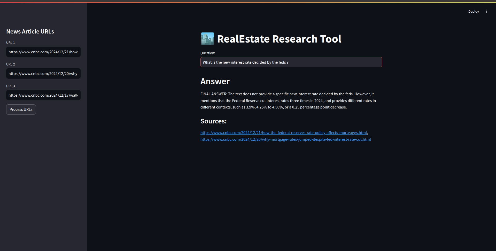

# 🏙️ **RealEstate Research Tool**

We are going to build a user-friendly news research tool designed for effortless information retrieval. Users can input article URLs and ask questions to receive relevant insights from the real-estate domain. (But it's features can be extended to any domain.)

### Features

- Load URLs to fetch article content.
- Extract readable text from HTML articles and preserve the source URL.
- Construct an embedding vector using HuggingFace embeddings and leverage ChromaDB as the vectorstore, to enable swift and effective retrieval of relevant information.
- Interact with a Groq-hosted LLM by inputting queries and receiving answers along with source URLs.


### Set-up (macOS/Linux)

Open the **`GenAI_Project1_resources`** folder in VS Code, then run these commands
from its terminal:

```bash
python3 -m venv .venv
source .venv/bin/activate
python -m pip install --upgrade pip
python -m pip install -r requirements.txt
```

VS Code is configured to use `.venv` automatically. For a notebook, click the
kernel name in the upper-right corner and select `.venv/bin/python` if it is not
already selected.

The notebooks work without an API key. The URL examples need an internet
connection. To use the Streamlit application, create its private environment
file:

```bash
cp real-estate-tool/.env.example real-estate-tool/.env
```

Open `real-estate-tool/.env` and replace the placeholder with a key from the
[Groq console](https://console.groq.com/keys). Do not commit this file.

Start the application from the workspace root:

```bash
python -m streamlit run real-estate-tool/main.py
```

The Hugging Face embedding model is downloaded the first time URLs are
processed, so that first run can take a few minutes.


### Usage/Examples

The web app will open in your browser after the set-up is complete.

- On the sidebar, you can input URLs directly.

- Initiate the data loading and processing by clicking "Process URLs."

- Observe the system as it performs text splitting, generates embedding vectors using HuggingFace's Embedding Model.

- The embeddings will be stored in ChromaDB.

- One can now ask a question and get the answer based on those news articles

- In the tutorial, we will use the following news articles
  - https://www.cnbc.com/2024/12/21/how-the-federal-reserves-rate-policy-affects-mortgages.html
  - https://www.cnbc.com/2024/12/20/why-mortgage-rates-jumped-despite-fed-interest-rate-cut.html
  - https://www.cnbc.com/2024/12/17/wall-street-sees-upside-in-2025-for-these-dividend-paying-real-estate-stocks.html


</br>

---
Copyright (C) Codebasics Inc. All rights reserved.

Additional Terms: This software is licensed under the MIT License. However, commercial use of this software is strictly prohibited without prior written permission from the author. Attribution must be given in all copies or substantial portions of the software.
